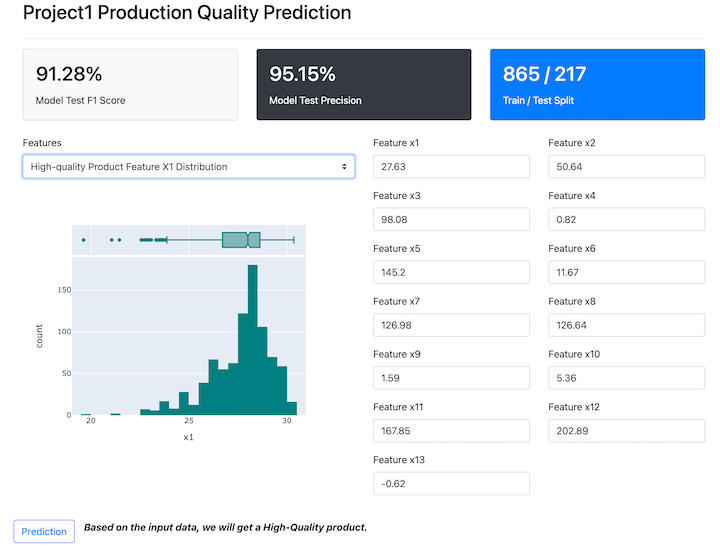
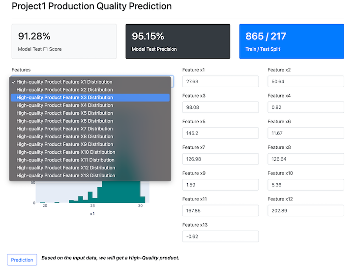

# Project1_Prediction_APP

In this app, we uses a logistic regression model trained on real-world refinery product data for predicting the prodcut quality. The app is built 

We not only can use the app to predict the result based on out inputs, but we can also visualize the high-quality product features distribution and experimently turn the feature values to have a better result.

